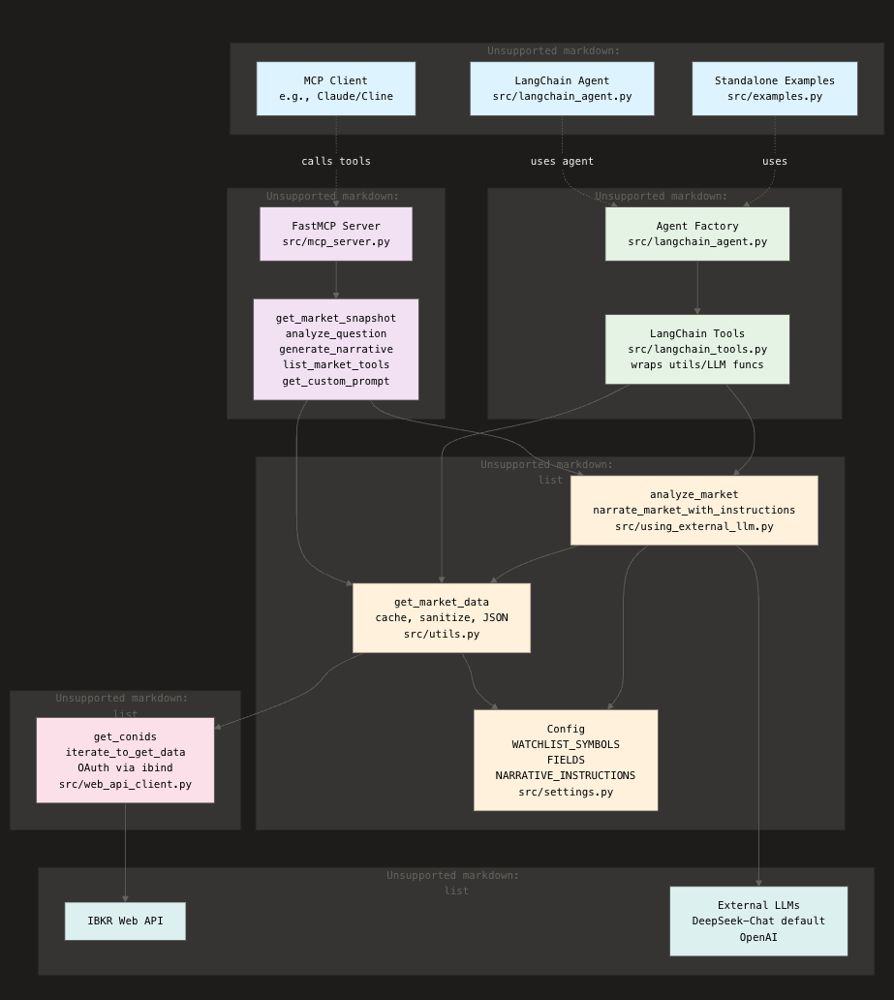

# IBKR Headless MCP Server Architecture

## Layers and Data Flow

```mermaid
graph TB
    subgraph Clients["1. Entry Points / Clients"]
        MCP[MCP Client<br/>e.g., Claude/Cline]
        LangChain[LangChain Agent<br/>src/langchain_agent.py]
        Examples[Standalone Examples<br/>src/examples.py]
    end

    subgraph MCPServer["2. MCP Server"]
        FastMCP[FastMCP Server<br/>src/mcp_server.py]
        Tools[get_market_snapshot<br/>analyze_question<br/>generate_narrative<br/>list_market_tools<br/>get_custom_prompt]
    end

    subgraph LangChainLayer["3. LangChain Layer"]
        LTools[LangChain Tools<br/>src/langchain_tools.py<br/>wraps utils/LLM funcs]
        LAgent[Agent Factory<br/>src/langchain_agent.py]
    end

    subgraph Core["4. Core Utilities"]
        Utils[get_market_data<br/>cache, sanitize, JSON<br/>src/utils.py]
        LLMWrap[analyze_market<br/>narrate_market_with_instructions<br/>src/using_external_llm.py]
        Settings[Config<br/>WATCHLIST_SYMBOLS<br/>FIELDS<br/>NARRATIVE_INSTRUCTIONS<br/>src/settings.py]
    end

    subgraph IBKRClient["5. IBKR Web API Client"]
        WebAPI[get_conids<br/>iterate_to_get_data<br/>OAuth via ibind<br/>src/web_api_client.py]
    end

    subgraph External["6. External Services"]
        IBKRapi[IBKR Web API]
        LLMapi[External LLMs<br/>DeepSeek-Chat (default)<br/>OpenAI]
    end

    %% Flows
    Clients -.->|calls tools| MCPServer
    Clients -.->|uses agent| LangChainLayer
    MCPServer --> Tools
    LangChainLayer --> LTools
    Tools --> Utils
    Tools --> LLMWrap
    LTools --> Utils
    LTools --> LLMWrap
    Utils --> Settings
    Utils --> IBKRClient
    LLMWrap --> Utils
    LLMWrap --> Settings
    LLMWrap --> LLMapi
    IBKRClient --> IBKRapi

    classDef client fill:#e1f5fe
    classDef mcp fill:#f3e5f5
    classDef langchain fill:#e8f5e8
    classDef core fill:#fff3e0
    classDef ibkr fill:#fce4ec
    classDef external fill:#e0f2f1

    class MCP,LangChain,Examples client
    class FastMCP,Tools mcp
    class LTools,LAgent langchain
    class Utils,LLMWrap,Settings core
    class WebAPI ibkr
    class IBKRapi,LLMapi external
```

## Key Flows

1. **Market Snapshot**: `get_market_snapshot()` → `utils.get_market_data()` → `web_api_client.iterate_to_get_data()` → IBKR API → JSON data

2. **Analysis**: `analyze_question(q)` → `using_external_llm.analyze_market(q)` → prompt(LLM instructions + market data + q) → DeepSeekChat → analysis text

3. **Narrative**: `generate_narrative()` → `using_external_llm.narrate_market_with_instructions()` → prompt(NARRATIVE_INSTRUCTIONS + market data) → LLM → narrative

## Notes
- Data cached in `utils.py`.
- Multi-LLM support via `using_external_llm.py`.
- Settings in `src/settings.py` (copy from example).

See [README.md](README.md) for setup/usage.
